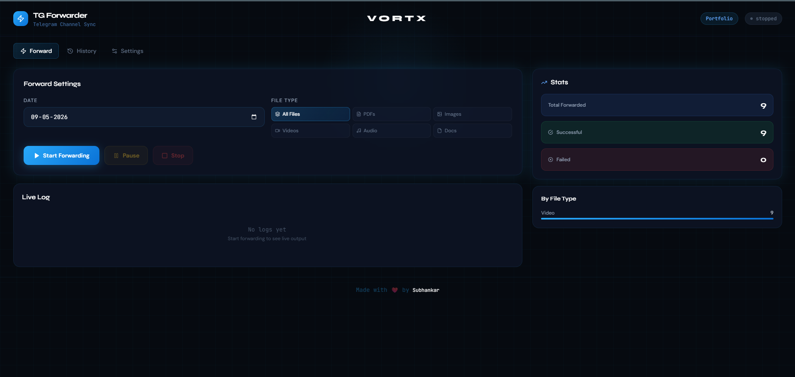
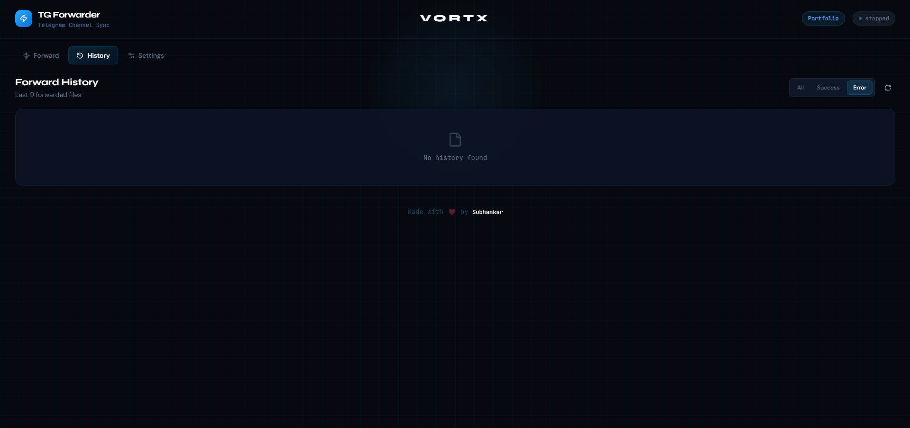
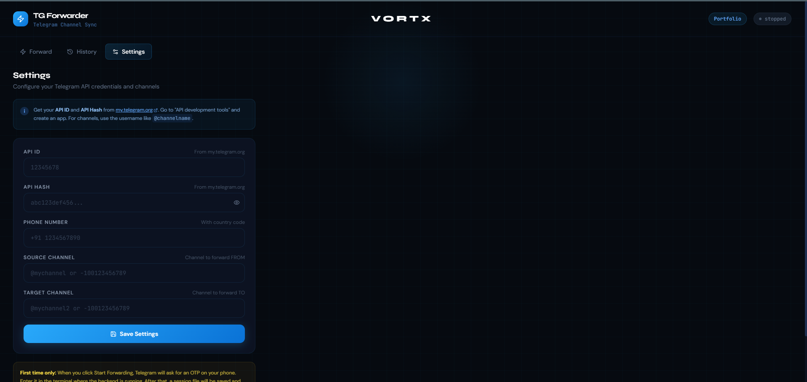

# ⚡ Vortx — TG Forwarder

A clean, powerful Telegram channel file forwarder with a beautiful dark web dashboard. Forward files from one channel to another — with live logs, stats, history, and full control.

---

## 📸 Screenshots





---

[](https://render.com/deploy)
&nbsp;&nbsp;
[](https://pages.cloudflare.com)

---

## ✨ Features

- 📅 Pick any date to forward files from
- 🔍 Filter by file type — PDF, Image, Video, Audio, Document, or All
- ▶ ⏸ ⏹ Start, Pause, Resume, Stop controls
- 📡 Real-time live logs via WebSocket
- 📊 Stats dashboard — total, success, failed, by file type
- 📝 History table of all forwarded files
- 🔒 Password-protected Settings page
- 🔁 Cloudflare Worker to keep backend alive (no cold starts)
- 🎨 Beautiful dark UI — built with React + Tailwind

---

## 📁 Project Structure

```
vortx-tg-forwarder/
├── backend/
│   ├── main.py              # FastAPI backend
│   ├── forwarder.py         # Telegram forwarding logic
│   ├── requirements.txt     # Python dependencies
│   └── config.json          # Config (DO NOT commit this)
├── frontend/
│   ├── src/
│   │   ├── App.jsx
│   │   ├── Dashboard.jsx
│   │   ├── Settings.jsx
│   │   └── History.jsx
│   ├── .env                 # (DO NOT commit this)
│   └── package.json
└── worker.js                # Cloudflare Worker — keeps backend awake
```

---

## 🚀 Deployment Guide

### Step 1 — Get Telegram API Credentials

1. Go to [https://my.telegram.org](https://my.telegram.org)
2. Log in with your Telegram phone number
3. Click **"API development tools"**
4. Create an app (any name, any platform)
5. Copy your **API ID** and **API Hash**

---

### Step 2 — Deploy Backend on Render

1. Go to [https://render.com](https://render.com) and sign in
2. Click **"New +"** → **"Web Service"**
3. Connect your GitHub repo
4. Set the following:

| Field | Value |
|---|---|
| **Root Directory** | `backend` |
| **Runtime** | `Python 3` |
| **Build Command** | `pip install -r requirements.txt` |
| **Start Command** | `python -m uvicorn main:app --host 0.0.0.0 --port 10000` |

5. Under **Environment Variables**, add:

| Key | Value |
|---|---|
| `ADMIN_PASSWORD` | your_strong_password_here |

6. Click **"Create Web Service"**
7. Copy your Render URL — it will look like `https://your-app.onrender.com`

> ⚠️ Free tier Render services sleep after inactivity. Set up the Cloudflare Worker (Step 4) to prevent this.

---

### Step 3 — Deploy Frontend on Cloudflare Pages

1. Go to [https://pages.cloudflare.com](https://pages.cloudflare.com) and sign in
2. Click **"Create a project"** → **"Connect to Git"**
3. Select your GitHub repo
4. Set the following:

| Field | Value |
|---|---|
| **Root Directory** | `frontend` |
| **Framework preset** | `Vite` |
| **Build command** | `npm run build` |
| **Build output directory** | `dist` |

5. Under **Environment Variables**, add:

| Key | Value |
|---|---|
| `VITE_API_URL` | `https://your-app.onrender.com` |

6. Click **"Save and Deploy"**

---

### Step 4 — Set Up Cloudflare Worker (Keep Backend Alive)

This worker pings your Render backend every 14 minutes so it never goes to sleep.

1. Go to [https://workers.cloudflare.com](https://workers.cloudflare.com)
2. Click **"Create a Worker"**
3. Paste the contents of `worker.js` into the editor
4. Replace `PUT_YOUR_RENDER_URL_HERE` with your actual Render URL:
```js
await fetch("https://your-app.onrender.com/status");
```
5. Click **"Save and Deploy"**
6. Go to your Worker → **"Triggers"** tab → **"Cron Triggers"**
7. Add cron: `*/14 * * * *` (every 14 minutes)

> The worker also has a public URL where you can check its status — it shows a live ping page with last ping time in IST.

---

### Step 5 — First Time Setup

1. Open your Cloudflare Pages URL in browser
2. Go to **Settings** tab
3. Enter your admin password (the one you set in Render environment variables)
4. Fill in:
   - API ID and API Hash (from my.telegram.org)
   - Phone number (with country code, e.g. `+91 1234567890`)
   - Source Channel (where files are uploaded)
   - Target Channel (where files should be forwarded)
5. Click **Save Settings**

---

### Step 6 — First Time OTP

When you click **Start Forwarding** for the very first time:
- Telegram will send an OTP to your phone
- Check the **Render logs** (Dashboard → your service → Logs)
- Telethon will prompt for the OTP there
- After entering it once, a session file is saved — you won't need OTP again

---

### Step 6.5 — Save Session as Environment Variable (Important!)

Every time Render redeploys, the session file gets deleted — meaning you'll have to enter the OTP again. To fix this permanently, convert your session file to base64 and save it as a Render environment variable.

**Do this once after entering OTP for the first time:**

1. Go to your `backend/` folder on your local machine
2. Run this command:

```bash
python -c "import base64; data = open('tg_session.session','rb').read(); print(base64.b64encode(data).decode())"
```

3. Copy the long string that gets printed
4. Go to Render Dashboard → your service → **Environment Variables** → add:

| Key | Value |
|---|---|
| `TG_SESSION_B64` | (paste the copied string here) |

5. Click **Save** and redeploy

Your session is now permanently saved — no more OTP prompts on redeploy.

---

## 📖 How to Use Daily

1. Open your Cloudflare Pages URL
2. Go to **Forward** tab
3. Pick a date
4. Pick file type filter (or keep All Files)
5. Click **▶ Start Forwarding**
6. Watch live logs in real time!

---

## 🛠 Local Development

### Backend
```bash
cd backend
pip install -r requirements.txt
python -m uvicorn main:app --reload --port 8000
```

### Frontend
```bash
cd frontend
npm install
npm run dev
```

Frontend runs at `http://localhost:5173`, backend at `http://localhost:8000`.

Make sure `frontend/.env` has:
```
VITE_API_URL=http://localhost:8000
```

## 🙏 Credits

- [Telethon](https://github.com/LonamiWebs/Telethon) — Python Telegram client library that powers the forwarding engine
- [Claude](https://claude.ai)
- Built with ❤️ by [Subhankar](https://github.com/Subhankar43)

---

## 📄 License

MIT License — free to use, modify, and distribute. See [LICENSE](LICENSE) for details.